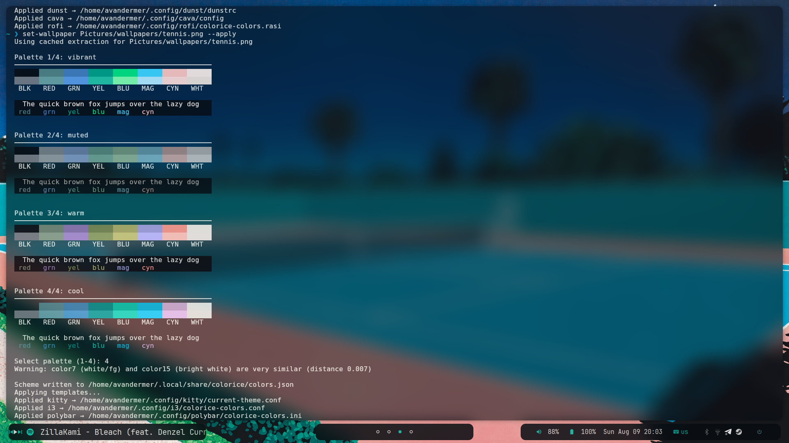

# Dotfiles
This repository contains my personal configuration files for a Linux tiling window manager setup based on **i3wm**. The aesthetic and color palette of the entire system are fully dynamic and generated on the fly using **colorice** (a modern alternative to pywal based on Oklab color space).



## Features & Setup   
 
* **Window Manager:** [i3wm](https://i3wm.org/)                                     
* **Bar:** [Polybar](https://polybar.github.io/)    
* **App Launcher:** [Rofi](https://github.com/davatorium/rofi) 
* **Terminal:** [Kitty](https://sw.kovidgoyal.net/kitty/)  
* **Compositor:** [Picom](https://github.com/yshui/picom)                                        
* **Notifications:** [Dunst](https://dunst-project.org/) 
* **Screenshots:** [Flameshot](https://flameshot.org/)  
* **Audio Visualizer:** [Cava](https://github.com/karlstav/cava)
* **Shell:** Bash / Zsh

## Colorice Integration (Dynamic Colors)                                               

The core feature of this rice is the **[colorice](https://github.com/rattle99/colorice)** integration. 
Whenever the wallpaper changes, `colorice` automatically extracts the dominant colors using the Oklab color space and applies beautiful palettes (Vibrant, Muted, Warm, Cool) system-wide.

Currently, `colorice` dynamically themes:
- i3 window borders
- Polybar
- Rofi menus
- Kitty terminal (updates on-the-fly)
- Dunst notifications
- Cava audio visualizer

### Usage
- **`Super + w`**: Set a random wallpaper and apply a random colorice mood (vibrant, muted, warm, or cool).
- **`set-wallpaper /path/to/image.jpg`**: Set a specific wallpaper and choose the palette interactively via terminal.

### Planned Features (TODO)                                                         
- [ ] **Firefox Theme:** Integrate dynamic colors to generate userChrome.css / Firefox colors based on the current wallpaper.
- [ ] **Spotify Theme:** Add dynamic color support for Spotify using [Spicetify](https://spicetify.app/).

## Installation                                                                     

To use these dotfiles, clone the repository and run the installation script.
```bash
# Clone the repository
git clone https://github.com/YOUR_USERNAME/dotfiles.git ~/dotfiles

# Run the installer
cd ~/dotfiles
chmod +x install.sh
./install.sh
```
> Warning: Make sure to backup your existing configurations before replacing them!
